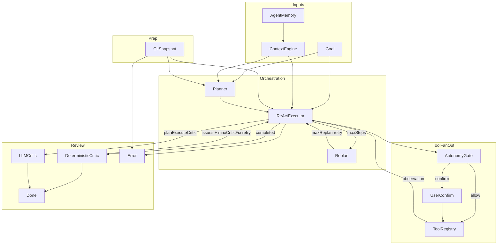

# Agent 编排架构

Agent 循环的编排拓扑使用 DAG(有向无环图)+ 有预算回边表达,避免单链 A→B→C 的僵化顺序。

## 阶段节点

- `snapshot` — Git snapshot(回滚点)
- `context` — ContextEngine 摘要
- `plan` — Planner
- `execute` — ReActExecutor
- `gate` — AutonomyGate
- `confirm` — UserConfirm
- `tools` — ToolRegistry
- `replan` — Replan(有预算 retry)
- `critic_det` — DeterministicCritic
- `critic_llm` — LLMCritic
- `done` / `error` — 终止节点

## 边语义

- `forward`: 正常推进
- `retry`: 有预算的回边(replan / critic-fix),运行时消耗 `maxReplan` / `maxCriticFix`,避免无限循环

## 拓扑图

## 三档预设

运行时根据用户选择的 `Topology` 取 DAG 子图:

- `singleReact` — Execute ↔ Tools 环 + Done
- `litePlanExecute` — fan-in(Plan) + Execute↔Tools + CriticDet → Done
- `planExecuteCritic` — 同上 + 双轨 CriticDet ∥ CriticLlm → Done

实现位于 `src/main/ai/agent/topology.ts`。
